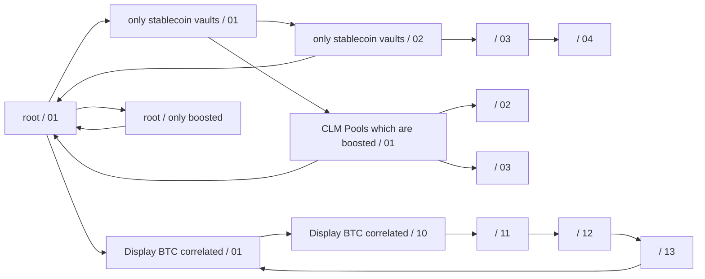

# Beefy.finance case — source materials (2026-08-19)

Figma team **inBuro** (`1634444530594785592`), folder `641498039`. All file names
carry a trailing `(копия)` — an artifact of pulling the archive out of the
working folder, ignore it. Both words that were unclear in dictation resolved
against real file names: "чимпы" = **Chimp**, "Iran" = **Eren**.

## The eight files

| File | Key | What it holds |
|---|---|---|
| BIFI Page | `lNTtiFu5jna8inOn7L8WG2` | One frame, `1272 Desktop` — the main-page redesign around the BIFI token |
| Beefy research | `xQR3f3sPrc58BgHuDPDkQ7` | FigJam. Four researched tasks, each with a full method chain |
| User tests | `PccpHR5BBJg7RklkyRCqwQ` | 6 pages: Boosts mobile/desktop, **Filtering v.2**, **Insights**, **Versions**, Discussions |
| Chimp | `w19zB3go9avtRuRTuVFNhF` | Risk Checklist, Use Cases, beGEMS Season 2 (desktop/tablet/mobile) |
| Eren | `zFXf7kedrhi3ROWqtBKPzb` | 40 pages of shipped work: ZAP flows, Featured vaults 2.0, paddings standardisation, main page |
| v2.4 Beefy Design System | `gHUv86cFszutgPbGnCaPwu` | 26 component pages — tokens, typography, icons, navigation, notifications |
| Product | `3PXfT9sLRAuV3YifVP5kJf` | 138 pages. **17 dated tasks**, Oct 2025 → Jul 2026, each with Layout research / Usecases / Dev review |
| Untitled (board) | `sKHHFkTQWF1IGhBPz6CvzA` | Cross-chain ZAP — full product argument: personas, JTBD, edge cases, impact on the main page |

## The strongest thread — filter rework

This one has evidence, not just screens.

**Users' own words** (User tests → Insights) — how people actually approach the vault list:

> "I first choose which chain I want to use then pool vault or clm. then the tokens I want to use"
> "search by type of coin (stable, bluechip, etc), type of vault (single, LP, CLM), sort by descending APR/APY, then chain"
> "always start with a clear all, then select all applicable filter until getting desired result"
> "Scroll down the first page, if i dont find what im looking for use the filter"
> "looking for a good yield vs risk tradeoff"

**First-click analysis**, same page — where the first, second and third click land:

| Category | Click 1 | Click 2 | Click 3 |
|---|---|---|---|
| chain | 2 | 0 | 0 |
| stablecoins / bluechip / correlated | 2 | 0 | 0 |
| boosted vaults | 1 | 0 | 0 |
| clear all | 1 | 0 | 0 |
| type (stablecoin, correlated) | 0 | 2 | 0 |
| vault type (pool/vault/CLM) | 0 | 2 | 0 |
| token | 0 | 1 | 1 |
| APR/APY | 0 | 1 | 1 |
| platform | 0 | 0 | 1 |

The shape of the answer is in the data: chain and asset category own the first
click, vault type the second, APR/APY and platform the tail. That is a
prioritisation argument, not a preference.

**Design reasoning** is written on the Versions page in Kirill's own working
notes — why Sort sits above the other controls, why saved and open positions
moved into an "All vaults" dropdown, why the mobile filter drops abbreviations,
why filters expand on the current page instead of a scroll area with
unpredictable position.

## Research method on the FigJam board

Four tasks, each run through the same chain: Incoming data → Mission → Goal →
Audience → Task understanding → Discovery (stakeholder discussion, competitor
research) → hypotheses on cover drafts → Prioritisation against imagined value
vs cost of development → Design drafts → MLP outline → health metrics →
success criteria.

1. **Boosted vaults upgrade** — the old design pinned 1–3 boosted vaults to the top; that stopped scaling
2. **Suggested vaults for retired vaults** — vaults close over time, users land on a dead end
3. **Improving BIFI token visibility in the app** — the thread behind the BIFI Page file
4. **Simple user mode** — stated problem: newcomers cannot cope with filter and staking-strategy settings

## Shipped work — the 17 dated tasks (Product file)

Enhanced Search (12/07/26) · Auto refresh animation (22/06/26) · CLM merge (17/06/26) ·
MainPage padding fix (17/06/26) · Free ZAP campaign (26/05/26) · Wide lanes hiding (19/05/26) ·
Featured vaults 2.0 (13/05/26) · Transaction "dust" (27/04/26) · MegaETH Points banner (24/04/26) ·
Vault to Vault ZAP (13/04/26) · Blogpost (07/04/26) · Cross-chain ZAP (26/01/26) ·
Sign a message page (16/01/26) · Paddings standardization (04/12/25) ·
Curator logos for the Platform (08/11/25) · Updated Safety Score card (07/11/25) ·
New wallet connector (06/10/25)

This list alone is a credible answer to "what did you actually ship there" —
useful in interviews even before the case page exists.

## Still open

- What is publishable vs internal-only — no NDA answer yet
- Numbers beyond 12,000 MAU: Maze completion/time results, before/after on the
  filters, retention. The first-click table is the only measured artifact found
  so far
- How many participants the Maze test had — the Discord recruitment is described,
  the sample size is not in the file

## Structure to follow

Ten-block shape from `career/portfolio/marketguard-case-copy-2026-08-16.md`.
Anything the reader must remember is text, never an image.

---

# Full folder map (read 2026-08-19)

Every file below was opened and read. This section is the "where things live"
index — consult it before opening Figma again.

## Beefy research (FigJam, `xQR3f3sPrc58BgHuDPDkQ7`) — the method file

Four tasks, each run through the same chain: Incoming data → Mission → Goal →
Audience → Task understanding → Discovery (stakeholders + competitors) →
cover drafts with hypotheses → Prioritisation on imagined value vs cost of
development → Design drafts → MLP outline → health metrics → success criteria.

1. **Boosted vaults upgrade.** The real problem, in the file's own words: Beefy
   used to run 1–3 boosted vaults and pinned them to the top; growth took that
   to 5–10, then Profit Distribution boosts pushed it to 20–30 at once, and
   pinning stopped working. Goal: users see immediately that 20+ vaults are
   boosted. Success criteria are stated as statistically significant increases
   in boosted deposits and element click-rate. ~25 solution hypotheses listed,
   sorted Must / Nice to have.
2. **Suggested vaults for retired vaults.** Vaults close (rewards end, platform
   shuts down, hack); users withdraw and there is no data on whether they stay.
   Three user segments named — loyal, one-time, opportunists. Long hypothesis
   list, including a "missed profit" indicator, potential-yield lines on the
   accrued-yield chart, redeposit streak bonuses, gamified levels.
3. **Improving BIFI token visibility.** The strategy behind the BIFI Page file —
   11 numbered content blocks, each with a proposed UI pattern and a note.
   Includes tokenomics framing (80,000 BIFI fully circulating, no new mining),
   four personas (investor without the token, knows-BIFI-but-not-utility,
   holder-checker, data maniac), and a Sankey money-flow for revenue by chain.
4. **Simple user mode.** Problem: newcomers cannot handle filter and staking
   settings. Proposes a Classic ↔ Strategy Mode switch and a calculator for
   amount and term.

## Untitled board (`sKHHFkTQWF1IGhBPz6CvzA`) — cross-chain ZAP strategy

Not a leftover — this is a full product argument. Without the feature a user
must identify the vault's chain, find their own asset's chain, bridge, pay gas,
come back and deposit; every step is a drop-off point. Contains three personas
with JTBD (newcomers, multi-chain users, yield hunters), the key message
("Deposit from any chain in one transaction"), the hierarchy argument
(Token → Network → Vault, not Vault Network → Allowed Tokens), edge cases
(fees above a threshold, unsupported route, slippage, bridge timeout, on-chain
revert), and a section on how the main page changes meaning: the chain filter
stops answering "what can I do" and starts answering "where does the strategy
run / how much gas will entry cost". Stakeholder replies are inline.

## User tests (`PccpHR5BBJg7RklkyRCqwQ`) — the filter evidence

- **Filtering v.2** (28 frames) — the test tasks themselves, named as scenarios:
  "only stablecoin vaults", "Display BTC correlated vaults and pools",
  "CLM Pools which are boosted", "Use filters to go back to default view"
- **Insights** — user quotes + the first-click table (see above)
- **Versions** — V.1, V.3, V.4 plus "Sorting / Filtering order" and an
  alternative representation, annotated with the reasoning behind each choice
- **Boosts mobile / desktop** — cold list, boosted-only, vault states
- **Discussions** — one empty frame

## BIFI Page (`lNTtiFu5jna8inOn7L8WG2`)

A single `1272 Desktop` frame — the executed answer to research task 3.

## Chimp (`w19zB3go9avtRuRTuVFNhF`)

Risk Checklist, Use Cases (folded/expanded, all-positive, all-negative states),
and beGEMS Season 2 across desktop / tablet / mobile with explicit state names
("Season 1 ended, Season 2 ongoing, wallet connected…"). Plus a breakpoint
ladder page: 1440 / 1260 / 1259 / 1100 / 1053 / 960 / 959 / 600 / 599 / 360.

## Eren (`zFXf7kedrhi3ROWqtBKPzb`)

40 pages of shipped work — Free ZAP, V2V Migration, Featured vaults 2.0,
Vault-to-vault and Cross-chain ZAP, paddings standardisation, Sign a Message,
main page, vault page, navigation / RPC / asset menus across desktop, mobile
and tablet, adaptive sizing. Most tasks carry Usecases / Layout resizing /
Dev review sub-pages.

## Product (`3PXfT9sLRAuV3YifVP5kJf`) — the archive

138 pages. 17 dated tasks Oct 2025 → Jul 2026 (listed above), each typically
with Layout research / Use Cases / Dev review, plus non-dated areas: Ultimate
Vaults, Tooltips upgrade, Dashboard, Treasury, Bridge BIFI, Buy crypto,
beGEMS Season 1, Sorting & filtering (desktop / mobile / tablet + production
review + research), Vaults-heading upgrade, Boosted vaults visibility, and
"Improving BIFI token visibility" with Analysis / Competitors research /
Illustration / V.0 / V.1.

## v2.4 Beefy Design System (`gHUv86cFszutgPbGnCaPwu`)

26 component pages: Accordion, Buttons, Colors, Dropdown, Divider, Graph,
Keyboards, Logo, Navigation + Footer, Notification, Progressbar, Scroll-bar,
Shadows and Effects, Sorting, Tabbar + Navbar + Selector, Tag, Toast
notifications, Toggle, Tips, Tooltip, Typography, Icons (+ Animation),
Input fields, Browser.

## Authorship — settled by Kirill 2026-08-19

- **Product** — everything inside is Kirill's own work. He assembled the file
  himself. Dates in page names only start partway through: earlier tasks were
  not dated, which is why the "17 dated tasks" list undercounts the real output.
  The **only exception is the archive at the bottom of the file**, which holds
  work by previous designers — do not draw from it.
- **Eren** and **Chimp** are **two developers**, not designers. Those files are
  handoff copies: Kirill copied approved layouts into them so the developers'
  reference would stay frozen while he kept iterating elsewhere. The design
  work in them is his; their value is as evidence of a handoff practice, not as
  separate projects.
- **v2.4 Beefy Design System** — his.

Practical consequence for the case: the "what I shipped" list should not stop at
the 17 dated pages. Undated pages in Product — Ultimate Vaults, Tooltips
upgrade, Dashboard, Treasury, Bridge BIFI, Buy crypto, beGEMS Season 1, Sorting
& filtering, Vaults-heading upgrade, Boosted vaults visibility, BIFI token
visibility — are his work too, just from before dating became the habit.

## Recruitment video — `~/Work/Beefy/testing.mp4`

15 seconds, 854×480, with audio, dated April 2025. A promo reel: animated
mobile screens of the app — portfolio with deposited / monthly yield, the chain
filter and Filters control, asset search, sort by date, boosted vault cards,
Beefy Treasury with holdings breakdown, Boosted Stable Rings, partners, token
selector. It ends on a deliberately retro VHS/BIOS-style menu card reading
`BEEFY.COM — Data Barn / Yield set-adjust / ▶ dApp testing / DAO function setup`
with the cursor on **dApp testing**.

Read as an artifact: this is the recruitment side of the research — the piece
that went out to the community to pull testers in. It pairs directly with the
Discord recruitment described for the filter study, and it is the one asset that
shows research operations rather than research output. End card saved as
`career/raw/beefy-testing-promo-endcard.png`.

> Confirm with Kirill: was this posted to the Beefy Discord to recruit testers,
> and is it his own work (design and edit) or a marketing-team piece?

---

## Started case assembly — Portfolio file, page "Beefy"

File `c1xBZrSIkUcGgsgEjSVsB7`, page `2697:40818`. A layout was already begun
here (in Russian), and it carries **numbers that appear nowhere else**:

- **63% of user time** goes to searching and analysing vaults — this is stated
  as the justification for treating sorting and filtering as the core activity
- **53 UX/UI improvements** in the released version
- Role as written: sole designer on an existing product, working directly with
  a PM and **two** developers; scope covered user research, UX/UI improvement,
  new feature design, and promo pages

**Problems catalogued before the rework** — desktop: the sort/filter element is
not pinned and scrolls out of view instantly; the filter list looks like a
button; excessive spacing between elements; the platform list is buried one
level deeper; boosted vaults sit inside the filters; minimum TVL is badly
represented. Mobile: the sort/filter section is likewise unpinned and vanishes
on scroll; filter and sort buttons read as two unrelated UX components; the
search placeholder sets no context for what can be typed.

**After release:** boosted vaults pinned inside the visible filter area, a Memes
filter selector added, filter layout packs the maximum number of controls at any
screen diagonal. The prototype used conditions and variables so the tested
experience matched the web product.

Second feature block started on the same page: **Navigation menu refactoring**.

> **Title — settled 2026-08-19: "Senior Product Designer".** An image on this
> page still shows an older CV entry reading "Product Design Lead"; that wording
> is dead. The master CV and the live site already say Senior Product Designer,
> so nothing needs changing there — just never revive the other title.

> **Team size — corrected 2026-08-19:** a PM and **two** developers, not three.
> The "three developers" line came from the started case layout and is wrong.

## Maze — no usable API (checked 2026-08-19)

There is no public developer surface: `developers.maze.co` does not resolve,
`api.maze.co`, `maze.co/api` and `maze.co/developers` all return 404, and the
help centre exposes no API section. Maze sells Free / Starter / Organization /
Enterprise tiers and integrates with Figma, Jira, Slack and Zapier, but nothing
indicates a self-serve REST API on any tier, let alone the free one.

Practical route for the case: export the report or CSV from the Maze UI and hand
the file over — parsing that locally is straightforward and needs no API.

---

## The prototype itself is evidence (read via Plugin API, 2026-08-19)

Page `Filtering v.2` in the User tests file — 28 top-level frames, one flow
(`Flow 1`), **88 unique frame-to-frame links**, 163 click triggers, 42 hover
triggers, 8 timeouts.

**Three variable collections drive it:**

- `Tokens` — 27 string variables (BTC, ETH, USDT, USDC, SOL, BIFI, MAI, LINK,
  DOGE, TON, AVAX, Sui, Shiba Inu, KAITO…). This is what let the search field
  behave like the real product instead of a fixed screenshot.
- `IconStates` — `iconState1`, `iconState2`
- `Actions` — numeric counters: **`ClickSum`, `FilterClick`, `Repeats`,
  `PlayCount`, `StableCoinVaultsWin`**

That last collection is the interesting part. `StableCoinVaultsWin` is a
success flag for a test task, and `ClickSum` / `FilterClick` / `Repeats` are
click counters. The prototype was instrumented — it counted the participant's
actions and decided whether the task was completed, rather than leaving all
measurement to Maze. That is a strong, checkable claim for the case: not "I made
a clickable prototype" but "I built a measuring instrument".

**Task flow, as wired:**

Each named branch is one Maze task: "use filters to display only stablecoin
vaults", "display BTC correlated vaults and pools", "CLM pools which are
boosted", "use filters to go back to default view".

> Conditional actions exist (80 of them) but neither the REST nor the Plugin API
> exposes the condition expressions themselves — both return empty
> `conditionalBlocks`. To show the conditions visually, a screenshot from the
> Figma editor is the only route.

---

## Recruitment, as it actually happened (Discord screenshots, 2026-08-19)

Server **Beefy**, channel `#app-testing` — and the channel history starts with
"This is the start of the #app-testing channel" on **26 March 2025**. The
channel was opened for this research, not borrowed from an existing one.

**The recruitment machinery:**

- A bot post — *"Opt-in for Field Testing Notifications. Reacting below will give
  you the @Field Tester role"* — **33 people opted in**. A standing, re-usable
  participant pool, not a one-off shout.
- Announcements were written by **Pablo** (team member), addressed to `@everyone`
  for the first wave and to `@Field Tester` for the second.

**Wave 1 — 26 March 2025.** Two tests announced at once: *Boosts* (making the
boosting process consistent with pool reward claims, and understanding how users
interact with boosts) and *Filters* (which filters are commonly used, which are
rarely used, what might be missing). The post states the ask plainly — five
minutes — and names the tooling: Maze, tracking clicks, misclicks and
interactions through heatmaps. Test link `t.maze.co/359319951`, no sign-up
required. Reactions: 26 🔥, 17 ✅.

**Wave 2 — 1 April 2025.** Aimed at filters *and search*, explicitly framed as
checking "whether the redesigned elements improve the experience" — i.e. a
post-redesign validation round, not a repeat of wave 1. Tasks on the prototype
plus free-form questions. Link `t.maze.co/364210345`. Reactions: 22 ✅, 13, 4 ❤️.

Community size visible in the sidebar: ~795 online, Core 4, Cattle Baron 9.

**Why this matters for the case:** the study was not "we asked a few people".
There is a repeatable research operation — a dedicated channel, an opt-in role,
a bot-driven pool of 33 field testers, sequenced waves, and a promo video
(`~/Work/Beefy/testing.mp4`) to pull people in. Very few product designers can
show that.

> To confirm with Kirill: whose idea were the `#app-testing` channel and the
> `@Field Tester` role, and who ran the Maze accounts — he designed the tests,
> but Pablo posted them. Also: are the two `t.maze.co` links still live, and can
> he open the result reports behind them?
