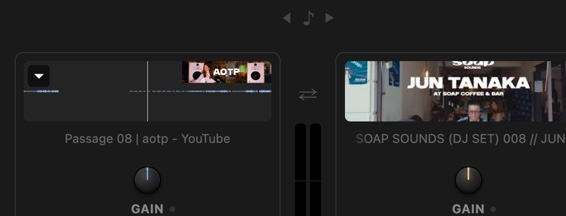

# GrooveMix — architecture reference

> Автор/владелец проекта называет себя **Cyrill** — использовать это написание в документе, не «Кирилл».ит" и на лету подмешивает свой трек в уже играющий эфир.
Не queue-плеер, не всегда открытое приложение — пульт, который вызывается по требованию.

**Эта папка (`fadercraft/groove mix/`, без суффикса) — мейнлайн продукта, источник истины.**
Опубликованная в Chrome Web Store версия (id `kiigcdfcmdanbpjpgilolmchobnpmjij`) ведёт свою
историю отсюда. Есть отдельная папка `fadercraft/groove mix (bandcamp)/` — форк, который в
какой-то момент добавил Bandcamp как второй источник (`tabCapture` + `offscreen.js`); этот форк
**запаркован**, его правки сюда не мержились и не мержатся, пока явно не попросят. Разошлись
где-то около v0.4.9 — между общей историей (см. `wiki/log.md`) и текущей v0.4.13 в этой папке
лежит пробел: правки (иконка дропдауна, открытие YouTube-таба и др.) были сделаны и
опубликованы в CWS, но никогда не закоммичены обратно в `~/Brain` — 2026-08-21 источник
восстановлен из `dist/GrooveMix.zip` (побайтово совпал с установленной в браузере v0.4.13).

## Паттерн (важно не перепутать с другими моделями)

- Аудио всегда идёт из самого YouTube — экстеншен ничем не владеет постоянно.
- Нет накопления очереди/плейлиста внутри приложения — это НЕ основной сценарий v1.
- Человек A: обычная YouTube-вкладка, играет как обычно, экстеншен не тронут, нулевой оверхед.
- Человек B: открывает свой трек в новой вкладке → жмёт иконку экстеншена → пульт.
- Панель закрылась — микс не останавливается, состояние живёт в самих вкладках.

## Топология (один комп, два физических YouTube-таба)

Почему не `chrome.tabCapture`: красная плашка "вкладка записывается" + звук в захваченной
вкладке глохнет — неприемлемо.
Почему не YouTube IFrame Player API: аудио остаётся чёрным ящиком (без EQ, без анализа), темп
только дискретными шагами. Для будущего роста не годится.
Два реальных таба — проще обоих вариантов, аудио остаётся в браузере как есть.

## Поверхность — Side Panel, не попап

`default_popup` заменён на `chrome.sidePanel` — единственная поверхность в Chrome с
drag-to-resize. `background.js` содержит одну строку: `chrome.sidePanel.setPanelBehavior({
openPanelOnActionClick: true })` — клик по иконке сразу открывает панель.

Ширина панели резиновая (`body { width: 100% }`), содержимое ограничено `max-width: 28rem` с
`margin: 0 auto` — при широкой панели контент центрируется, не разъезжается.

Единицы — `rem`, не `em`: `html { font-size }` — единственный рычаг масштабирования,
без компаундинга на вложенных узлах.

Панель скроллится целиком (`overflow-y: auto` на `body`), а не растягивает флекс-контейнер.

## Аудио-граф

Content script в MAIN world, инжектится через `chrome.scripting.executeScript(world:'MAIN')`
при первом коннекте деки — не на каждой YouTube-странице по умолчанию.

### Топология графа (на каждую деку)

```
<video> → MediaElementSource ─┬─→ LP×2 (250Hz) → GainLow ─┐
                              ├─→ HP×2 (250Hz) → LP×2 (2500Hz) → GainMid ─┤→ eqOut
                              └─→ HP×2 (250Hz, 2500Hz) → GainHigh ─┘
                                      eqOut → [FX bus] → Gain → Cross → destination
```

**3-полосный изолятор (параллельные пути, не серийная цепь):** каждая полоса — отдельный
параллельный путь с двумя каскадными Butterworth-фильтрами (~24 дБ/октава, Q=√½). Crossover
точки: 250 Hz (Low/Mid), 2500 Hz (Mid/High). Gain = 0 при EQ_MIN → честная полная тишина
полосы (не приблизительная), потому что путь сигнала обрывается на нулевом коэффициенте,
не зависит от свойств фильтра.

**FX-узел (post-EQ, pre-Gain) — переключаемый тип, не один фильтр (добавлено 2026-08-21):**
одна физическая ручка на деку, ◀/▶ рядом с лейблом переключают активный тип. Оба типа строятся
один раз при коннекте и работают постоянно — переключение только кроссфейдит два выходных гейна
(`fxFilterGate`/`fxDelayGate`, рампа 50мс), без disconnect/reconnect нод (класс багов с "не тот
узел отсоединили" из более ранней, так и не доехавшей до продакшена попытки — см. `wiki/log.md`).

- **Filter** (дефолт при коннекте): бинарный bipolar-фильтр, как раньше. Отрицательные значения —
  lowpass-sweep вниз от 20 кГц до ~100 Hz; положительные — highpass-sweep вверх от 20 Hz до 8 кГц.
  Экспоненциальная кривая (слух логарифмический). В нейтрали (0) — lowpass @ 20 кГц, прозрачен.
- **Delay**: `DelayNode` (потолок 2с) + фиксированный feedback 0.35 в петле, фиксированный
  equal-power 50/50 dry/wet (`Math.SQRT1_2` на обе стороны — не ручка). Ручка (0..1) управляет
  **плотностью повторов**, не громкостью: `delayTime = clamp((60/bpm) / 2^(v·3), 0.04, 1.5)`,
  BPM берётся из `eng.detectedBpm` (тот же детектор бита, что и для tempo-sync). Это осознанное
  архитектурное решение, не первая попытка — ручка "просто громкость мокрого сигнала" уже
  пробовалась и на слух не отличалась от изменения уровня, а не эха (см. `wiki/log.md`,
  запись про откат 2026-08-11 и её собственный незакрытый вопрос "wet-mix vs rate").
- Диапазон ручки зависит от активного типа (`fxRange(deck)` / `FX_TYPES`): Filter −1..1,
  Delay 0..1 (reset 0.5 — при переключении сразу слышно отличие от bypass, а не 0%).
- Смена типа требует пересборки графа только на СТАРЫХ вкладках (граф без `fxDelayGate` — тогда
  тип молча остаётся Filter, `counterDJSetFxType` возвращает ошибку вместо падения).

**Gain-узел:** отдельный line-fader после FX, перед кроссфейдером. Диапазон 0..1.5 (линейный),
юнити 1.0. Самостоятельный параметр, не связан с EQ.

**Кроссфейдер:** equal-power curve — `cos(p × π/2)` для A, `sin(p × π/2)` для B. Центр = оба
канала на полную.

**Cue-отвод:** post-Gain, pre-Cross (PFL) — отдельный `MediaStreamDestination` от Gain-узла,
подключённый к скрытому `<audio cueAudioEl>`. Переключение на cue-устройство через
`HTMLMediaElement.setSinkId()` (не `AudioContext.setSinkId()` — тот переключил бы весь контекст
включая мастер). При `active=false` просто `cueAudioEl.muted = true`, контекст не трогается.

**Beat-detector отвод:** параллельный lowpass 150 Hz от `source` (не от `low` EQ) — срез EQ
не ослепляет детектор. Сигнал через `ScriptProcessorNode` (не `requestAnimationFrame` —
rAF замораживается на фоновых вкладках; `ScriptProcessorNode.onaudioprocess` driven аудио-движком
и продолжает работать). `AudioWorkletNode` отклонён — требует внешний URL модуля, CSP-риск.

**Level meter:** post-EQ, pre-Gain — `AnalyserNode` с fftSize=512 → отдельный silent gain → destination.
RMS в дБ (клэмп до -60); опрашивается с панели отдельным быстрым циклом.

**Готча — граф собирается атомарно:** `createMediaElementSource(video)` монопольно захватывает
выход элемента — граф нужно собрать и подключить за один тик.

**Готча — `window.__counterDJ__` переживает SPA-навигацию:** YouTube — SPA, `__counterDJ__`
не уничтожается при переходе на другое видео. `counterDJSetup` при повторном вызове
(ветка `already:true`) возвращает полный статус и применяет переданные `initial`-значения
(EQ/Gain/rate/fxType), чтобы переподключение к уже настроенной вкладке правильно восстанавливало
состояние. После структурных изменений аудио-графа в коде нужна полная перезагрузка
YouTube-вкладки, иначе старый граф тихо не соответствует новому коду.

**Начальные значения при коннекте:**
- Дека A: EQ 0/0/0, FX filter/0, Gain 1.0 — плоская, без изменений.
- Дека B: EQ −40/−40/−40, FX filter/0, Gain 1.0 — почти беззвучна при инжекте без щелчка.
- Свежеподключённый трек принудительно ставится на паузу (`.pause()` в `counterDJSetup`) —
  DJ решает, когда старт, а не YouTube.

## Обнаружение "какой таб"

`chrome.tabs.query({ url: "*://*.youtube.com/*" })` + фильтр по `getVideoId(url)` (видео-id
в URL). Приоритет в автовыборе: `audible` вкладки первыми. `refreshTabs()` крутится каждые
2 секунды: автоматически подбирает вкладки в незаполненные слоты, а если один слот уже
connected — автоконнектит и второй. Оба слота пустые — ждёт ручного Connect.

`video.html5-main-video` первым (явный YouTube-класс), fallback — первый непаузеный, иначе
первый найденный.

## Транспорт и `isConnected`

`counterDJTransport(action)`: перед действием проверяет `eng.video.isConnected` и
переподбирает живой `<video>`, если исходный отвалился — YouTube подменяет элемент при
autoplay-next/рекламе/смене качества; `.play()/.pause()` на отсоединённом узле молча делает
ничего. При `restart`: `video.muted = false` (YouTube может автоплеить фоновую вкладку на
mute); `ctx.resume()` перед `.play()` (suspended-контекст — тишина); вкладка деки
принудительно переводится в `active` перед play — иначе Chrome блокирует autoplay на вкладке,
которая никогда не была в фокусе.

**Баг-класс:** `.play()` возвращает Promise, который может зарежектиться. Если не ждать/
не проверять — функция всегда отвечает `{ok:true}`, независимо от результата. Фикс:
`counterDJTransport` возвращает сам промис `.play()`, а вызов в панели проверяет `result.ok`.

**Баг-класс:** `chrome.scripting.executeScript` резолвится даже если инжектированная функция
вернула `{ok:false}`. Все `send*` функции (sendParam, sendFxType, sendTransport, sendSink и т.п.)
явно читают `result.ok` и показывают `result.error` в статус-строке.

## Skip (counterDJSkip)

Chapters-first: читает `ytd-macro-markers-list-item-renderer` DOM-ноды (live Polymer-элемент,
не `window.ytInitialData` — тот не обновляется при SPA-навигации на другое видео). Дедупликация
по `startSec` (один и тот же chapter рендерится в нескольких местах DOM). Smart-previous:
первое нажатие перемотки назад — к началу текущей главы, второе — к предыдущей.
Fallback: `.ytp-next-button` / `.ytp-prev-button`.

## Поллинг и детект разрыва

`pollDeckStatus()` — интервал 1 с, обе деки параллельно (`Promise.all`).

На каждый тик: обновляет `playing` только если изменилось, проверяет смену видео по video_id
(SPA-навигация не убивает `__counterDJ__` → надо ловить отдельно), обновляет title/thumb при
смене, при `connected:false` или упавшем `executeScript` — `disconnectDeck()`. Если у деки
активен Delay и BPM только что изменился (`bpmChanged`) — перепосылается текущее значение fx,
чтобы плотность эха пересчиталась под свежий темп (см. FX-узел выше).

`counterDJPoll()` возвращает: `connected`, `playing`, `chapterTitle` (null если нет глав или
placeholder "In this video" / "В этом видео"), `detectedBpm`, `beatCount`, `ctxState`,
`videoMuted`, `currentTime`, `lastOnsetWallClock`.

Название деки = текущая глава (`.ytp-chapter-title-content`, computed style + не-placeholder)
если есть, иначе `staticTitle` (заголовок видео как fallback).

`refreshTabs()` — интервал 2 с — также чистит unconnected-слоты, чьи вкладки закрылись
(stale cover art баг — только connected-деки имели другую защиту).

## Beat detector

Онсет-детектор в странице (`beatProcessor.onaudioprocess`), буфер 1024 сэмпла.

**Алгоритм:**
1. Half-wave rectified energy flux (рост энергии, не абсолютный уровень) — sustained bass не
   повторно-триггерит.
2. Adaptive threshold: mean + 1.5 × std-dev недавних flux-значений — не нужен ручной тюнинг.
3. Refractory: 300ms (потолок ~200 BPM).
4. IOI-histogram voting: каждый новый онсет голосует против последних 8 онсетов на нормализованный
   BPM (90–180). Голоса decay×0.98 на каждом онсете.
5. Нормализация: `while bpm < 90: ×2; while bpm > 180: /2` — разрешает half/double-time.
6. Confidence gate: `(totalVotes >= 5 && confidence > 0.25) || stableCount >= 4` для первого
   лока; после лока — 20 подряд согласных онсетов для сдвига.
7. EMA 0.08/0.92 после первого лока, пока stableCount ≤ SETTLE_STABLE_ONSETS (40). После 40
   устаканившихся онсетов — заморозка (perpetual creep был источником постоянного микро-дрейфа).

OBTAIN-стиль overlapping windows: кольцевой буфер ENERGY_WINDOW_SAMPLES=1024, hop EVERY
HOP_SAMPLES=256 — timing resolution ~5.8 мс вместо ~23 мс, O(1) sliding sum.

`counterDJResetDetector()` — сброс при SPA-навигации на другое видео (старый BPM-лок мог
висеть долго из-за липкости в 20 онсетов).

## Tempo/Sync

`video.preservesPitch = true` — честный time-stretch без "бурундука", браузерный нативный,
без своего DSP. Устанавливается при `counterDJSetup`, не повторяется на каждое изменение.

### TempoBlend bar

Горизонтальный слайдер 0..1 (drag + trackpad swipe + ←→ клавиши `tempoTrack`):
- `null` — не задействован.
- 0 → A-якорь: A на native, B подстраивается под A.
- 0.5 → оба гнутся к общей точке.
- 1 → B-якорь: B на native, A подстраивается под B.

Лид-дека: `t < 0.5` → A, `t >= 0.5` → B. Octave-hysteresis: удерживает прошлый octave
factor (1×/2×/0.5×/0.25×/4×), пока новый не лучше с запасом >15% — предотвращает дискретные
скачки rate на EMA-границе.

Из-за свопа дек `tempoBlend` инвертируется (`1 - t`) — чтобы роль lead/follow не менялась
после переставления треков.

`TEMPO_MIN = 0.5, TEMPO_MAX = 1.5`. Rate рампируется к 1.0 за 250 мс (20 шагов), а не
скачком — мгновенный snap слышен как pitch-click.

Авто-engage при первом детектированном BPM на обеих деках: если `tempoBlend == null` и
обе деки connected+playing+BPM detected → автоматически применяется blend=0 (A-якорь).

### Phase sync

`syncPhase()` — интервал 1 с, параллельно обе деки (`counterDJPhaseInfo`: last onset
wall-clock + rate). Использует `Date.now()`, а не `performance.now()` — тот не сопоставим
между разными вкладками.

**Kalman-фильтр:** state = [errorMs, errorRateMsPerSec]. Один экземпляр (не per-deck — только
один active pairing). Параметры: `kalmanMeasurementVar=900 ms²` (30 мс std), `kalmanProcessVarError=4`,
`kalmanProcessVarRate=2`, `kalmanStaleMs=3000`.

**PI-контроллер:** `applyPhaseTrim(deck, shift, periodMs)` — continuous каждый тик, не разовый рывок.
- Acquisition mode (`!wasPhaseSynced`): cap `acquisitionRateDelta=0.065` — быстрый захват.
- Locked mode (`wasPhaseSynced`): cap `bendRateDelta=0.012` — мягкая коррекция.
- `saturationBeatFraction=1/16` — порог насыщения пропорциональной части.
- `deadZoneBeatFraction=1/24` — ниже порога proportional=0, только integral работает.
- `integralGain=0.065`.

Туning-константы подобраны offline-sweep (sync-sim.js, не шипуется) против 3 сценариев ×
800 параметр-сетов, протестированы на 92/120/171 BPM.

**Schmitt-trigger для "Synced/Syncing":** `enterThresholdFraction=0.075` от периода бита,
`exitThresholdMultiplier=3.5` (выход из locked шире, чем вход) + dwell `syncDwellMs=800 мс`.
Гистерезис + dwell предотвращают мигание от шума ~46 мс (один аудио-блок).

**Phase nudge:** кнопки `phaseNudgeLeft/Right` — ±1/8 доля бита, `phaseOffsetEighths` (0..7,
wrap). Немедленный seek follower-деки + одиночный `syncPhase()`.

**Детали фикса dual-timer bug:** `applyTempoBlend` раньше слала rate при любом изменении
`detectedBpm` — EMA двигала его почти каждый онсет, это стирало phase trim `syncPhase()` ~раз
в секунду. Фикс: слать только когда rounded rate реально изменился.

## Клавиатурная раскладка

| Параметр | Дека A | Дека B | Заметка |
|---|---|---|---|
| High EQ | Q (−) / W (+) | P (−) / [ (+) | |
| Mid EQ | A (−) / S (+) | L (−) / ; (+) | |
| Low EQ | Z (−) / X (+) | , (−) / . (+) | |
| Gain | 1 (−) / 2 (+) | − (−) / = (+) | |
| FX | C (−) / V (+) | N (−) / M (+) | |
| Play toggle | E | O | |
| Crossfader | ← (к A) / → (к B) | | Trackpad-swipe на `#mixer` |
| Tempo blend | ↑ (+) / ↓ (−) | | Trackpad-swipe на tempoTrack |
| Deck swap | Tab | | |

`Shift + любой шаг` = ×10 скорость.

Правило направления (sequential): **левая клавиша пары = уменьшить, правая = увеличить**,
одинаково для обеих дек.

**Двойное нажатие (isolator-жест):** держишь обе клавиши пары одновременно — 40 мс debounce
(физически одновременные нажатия приходят двумя отдельными событиями):
- Ручка НЕ в нейтрали → снап к нейтрали (0 дБ / 1.0 gain / нейтраль активного fx-типа).
- Ручка В нейтрали → kill в минимум активного fx-типа.
`handledPairs` Set: один переход за физическое нажатие, сброс по keyup (OS auto-repeat не дублирует).

Двойной клик по ручке мышью = тот же жест через общую `resetOrKill(deck, param)`.

## Параметры и диапазоны

| Параметр | Min | Max | Step |
|---|---|---|---|
| EQ (low/mid/high) | −40 дБ | +6 дБ | 2 дБ |
| Gain | 0 | 1.5 | 0.05 |
| FX — Filter | −1 | +1 | 0.1 |
| FX — Delay (плотность) | 0 | 1 | 0.1 |
| Crossfader | 0 | 1 | 0.05 |
| Tempo blend | 0 | 1 | 0.02 (кнопки) |
| Playback rate | 0.5× | 1.5× | — (через blend) |
| Zoom | 0.75 | 1.75 | 0.125 |

Дефолтный zoom: 1.375 (применяется при загрузке, не только по клику).

Drag мышью: 3 px = 1 дБ (EQ), иная плотность для Gain и FX; FX-диапазон разрешается динамически
через `fxRange(deck)` в момент начала драга/колёсика (не статично при загрузке страницы) — иначе
драг по Delay клэмпился бы диапазоном Filter. Magnetic detent ±1 дБ вокруг нейтрали для EQ-ручек
при драге. Pointer capture — `setPointerCapture()` — drag не срывается при выходе курсора за
пределы узкой панели.

## UI — ключевые решения

**Кнопка Connect / ⇄ Swap:** одна и та же кнопка. До коннекта — "Connect" (зелёная CTA).
После — "⇄ Swap" (нейтральная). Отдельного "Connected ✓" индикатора нет — мёртвое место.

**Tab (своп):** меняет `state.decks.A ↔ B` целиком (tabId + EQ-значения + metadata).
Deck A/B — фиксированные позиции с фиксированными клавишами. При свопе `cross = 1 − cross`
(инверсия) — реальный слышимый баланс не меняется. TempoBlend тоже инвертируется.

**Отдельный "send track to other deck":** каждый dropdown деки имеет пункт "Send to Deck X" —
переносит только трек (`tabId` + metadata), EQ/Gain/crossfader/fx-тип остаются deck-bound.

**Подсветка деки** (`.dominant` и `setFocusedDeck`) — удалена полностью.

**Обложки:** `i.ytimg.com/vi/<videoId>/mqdefault.jpg` — публичный URL без API. Два места:
`#thumbA/B` (верхний пикер) и `#deckThumbA/B` (внутри mixer). Меняются местами при Swap.

**A/B маркировка:** `.clusterLabel` — текст снизу колонки ручек, `position:absolute;
bottom:1.25rem`, `.deck` имеет `padding-bottom:2.5rem`.

**Заголовок деки:** текущая глава (если есть) или staticTitle видео.

**Play-кнопка:** в `.deckLabel`-строке, отдельный фон `#222` — НЕ наследует `.dominant`,
чтобы не красилась при выделении канала (конвенция DJ-пультов). Иконка ▶ фиксирована, состояние
передаётся подсветкой (зелёный фон при playing).

**Tempo-статус:** два отдельных элемента `#tempoA/#tempoB` (A слева / B справа), акцентные
цвета деки. Показывает BPM (если detectedBpm) + rate %. "SYNCED" лейбл намеренно убран —
`rate_A === rate_B` не значит, что треки совпадают по битам.

**Phase drift индикатор:** `#phaseDriftLabel` — "Synced" / "Syncing" (Schmitt-trigger +
dwell).

**Green focus-border** на `#mixer` — CSS `:focus` — индикатор "клавиши сейчас сюда попадают".
Пунктирная рамка миксера убрана.

**Crossfader визуал:** тонкий тёмный трек (почти линия), крупный ползунок с градиентом+насечкой.
Mouse/pointer drag по crossTrack.

**FX ◀/▶ переключатель типа (добавлено 2026-08-21):** заменил статичный лейбл "FX" в
`.knobLabelRow` — та же строка, не отдельная (пробовали отдельной строкой сверху, убрали по
прямой правке в сессии). `.fxTypeBtn` — голый глиф без подложки, тот же язык, что `.skipBtn`/
`.phaseNudgeBtn`. `.fxTypeLabel` имеет `min-width` под самое длинное имя типа ("DELAY") — без
этого переключение типов меняло ширину строки и заметно дёргало соседнюю вёрстку.

**Zoom:** `±` кнопки в шапке, работают на `html { font-size }` через `applyZoom()`.
`ZOOM_MIN=0.75`, `ZOOM_MAX=1.75`, `ZOOM_STEP=0.125`.

**`body { min-width: 280px }`** — буквальные px, не rem (иначе масштабировался бы зумом и
при дефолтном 1.375× давал 385px вместо 280px, вызывая горизонтальный скролл).

## Масштабирование

`.container { max-width: 28rem; margin: 0 auto }` — не разъезжается при широкой панели.
`body { width: 100% }`. Панель скроллится вертикально (`overflow-y: auto` на `body`).

## Ручки (knobs)

SVG-дуга на каждой ручке: тёмный трек 270° + цветная дуга, заполненная от neutralAngle до
текущего угла (bidirectional). `setKnobArc()` двигает `stroke-dasharray`.

`tieredAngle(v, min, max)`: нейтраль строго на 12 часах (0°), ОБЕ стороны доходят до
механического предела ±135° — разная "скорость" дБ/градус в разные стороны при
асимметричном диапазоне (нормально, как у taper-потенциометра). Общая `linToAngle` не
использована — `tieredAngle` применяется ко всем параметрам. Логика геометрии живёт в
`deck-render.js` (`window.DeckRender`), общем с landing-репозиторием (`sync-deck.mjs`).

Дуга заполняется от нейтрали активного fx-типа (`fxRange(deck).reset`), а не от абсолютного
минимума — в покое дуга пустая, растёт при отклонении в обе стороны.

## Локализация

`chrome.i18n` — `default_locale: "en"`, 25 языков в `_locales/`. Браузер подбирает сам.
Технические слова (GAIN/HI/MID/LOW, DECK A/B, TEMPO и т.п.) намеренно остаются
по-английски во всех переводах — так принято в DJ-софте.

`langToggle` — кнопка-тумблер EN↔нативный язык для отладки переводов. Скрыта, если
браузер уже на EN.

## Триал и лицензия

`TRIAL_LIMIT_MS = 5 × 60 × 60 × 1000` (5 часов) — суммарное активное время воспроизведения
(хотя бы одна дека реально играет), не wall-clock. Живёт в `chrome.storage.local` (`usageMs`).

После лимита — баннер с ссылкой на Gumroad и полем ввода лицензионного ключа.

Активация: `sidepanel.js` → сообщение `verifyLicense` → `background.js` → `fetch` на
`api.gumroad.com/v2/licenses/verify` с `increment_uses_count=false` (иначе сгорал бы слот).
`GUMROAD_PRODUCT_PERMALINK = 'groove-mix'` — сверить актуальность листинга перед тем, как на
это полагаться (в бандкамп-форке на дату форка это ещё было TODO-заглушкой).

Флаг `trialLimitEventSent` персистится в `chrome.storage.local` — событие `trial_limit_reached`
слётает строго один раз.

## Аналитика (PostHog)

Инжект в `sidepanel.html` — `vendor/posthog.js` (self-hosted копия).
`posthog.init('phc_...', { api_host: 'https://groovemix.app/ingest', capture_pageview: false,
person_profiles: 'always', disable_external_dependency_loading: true })`.
`posthog.register({ source: 'extension' })` — все события tagged как extension.

Events: `track_loaded`, `track_skip`, `trial_limit_reached`, `license_activated`, `feedback_idea`,
`button_click`, `ui_error`. Super-properties (engagement): `used_crossfader`, `used_eq`,
`used_hotkeys`, `used_tempo_manual`, `used_zoom`, `used_phase_nudge`, `used_fx_type_switch`.

Owner exclusion: `localStorage.setItem('ph_owner','1')` в DevTools → `posthog.identify('groovemix-owner')`.
PostHog Error Tracking: `captureException` на `window.error` и `unhandledrejection`, с
breadcrumbs (rolling 20 последних действий).

## Cue (вывод на наушники)

PFL-схема: `cueAudioEl` тапует сигнал post-Gain, pre-Cross — слышна дека независимо от
кроссфейдера. `counterDJSetCue(deviceId, active)`: `HTMLMediaElement.setSinkId()` на
`cueAudioEl`, при `active=false` просто `muted=true`.

Device IDs: `counterDJMicPermissionState()`/`counterDJUnlockMic()`/`counterDJEnumerateOutputs()`
инжектируются в YOUTUBE.COM origin, не в chrome-extension:// — Chrome скопирует deviceId
под тот origin, где он был запрошен, и `setSinkId()` с "чужим" ID кидает NotFoundError.

Одна настройка "устройство для Cue" глобальная (`selectedCueDeviceId` персистируется в
`chrome.storage.local`). Состояние "cued" конкретной деки сбрасывается при дисконнекте.

## Виджет обратной связи

Кнопка ✎ рядом с заголовком `GrooveMix` — попап с открытым вопросом без тегов (сознательно —
не навязывать несданные гипотезы). Отправка: `posthog.capture('feedback_idea', { text })`.
Локализовано (25 языков).

## Иконки

**Два набора, оба обязательны — не один файл на все случаи:**
- `icons/icon-{16,48,128}.png` (манифест ссылается сюда) — **dev-набор, чёрный фон**. Существует
  специально, чтобы тестовую распакованную сборку можно было отличить на глаз (в списке
  расширений/на панели инструментов) от настоящей store-версии с тем же названием.
- `icons/prod/icon-{16,48,128}.png` — **прод-набор, прозрачный фон (alpha=0)**, тот самый
  визуальный дизайн (два перекрывающихся круга — A `#99ccff` непрозрачный + B `#ffcc99` ~87%
  альфа, R=0.34×canvas, центры на 0.37×W / 0.63×W, Canvas-скрипт с SS=4 supersampling), но без
  тонировки под фон — уходит в реальный CWS-листинг и в любую сборку, которая ставится не для
  тестирования.

`dist/GrooveMix/icons/` — тестовая сборка, значит **всегда dev-набор** (чёрный фон), никогда
`icons/prod/`. Синхронизировать вручную при копировании файлов в `dist/` (нет автосборки) —
однажды уже потерялось в бандкамп-форке (см. его `wiki/log.md`), поэтому здесь заведено сразу
правильно. Проверка: `shasum dist/GrooveMix/icons/icon-128.png icons/icon-128.png` — должны
совпадать (не с `icons/prod/icon-128.png`).

## Упаковка dist/ — ЖЁСТКОЕ ПРАВИЛО (исправлено 2026-08-21, см. ниже)

**Рабочая папка — КОРЕНЬ этого репозитория.** `Load unpacked` в Chrome/Brave указывает прямо
сюда (`sidepanel.js`, `sidepanel.html`, `styles.css`, `manifest.json` и т.д. в корне) — это и есть
то, что реально грузится в браузер при разработке и тестировании. Каждая правка кода тестируется
здесь, простой перезагрузкой расширения (и, если правка трогает аудио-граф — см. `counterDJSetup`
— ещё и полной перезагрузкой самой YouTube-вкладки).

**`dist/GrooveMix/` НЕ трогать во время обычной разработки.** Это не тестовая сборка и не
дублирующая копия для проверки — это исключительно площадка для упаковки перед отправкой на
ревью в Chrome Web Store (`dist/GrooveMix.zip`, см. `wiki/log.md` — так и уходило v0.4.9 через
`chrome.google.com/webstore/developer` API). Собирать/синхронизировать `dist/GrooveMix/` только
непосредственно перед реальной сдачей на ревью — не после каждой правки, не «на всякий случай».

**Почему это правило переписано именно так 2026-08-21:** первая версия этого правила (см. историю
файла) требовала синхронизировать `dist/` после КАЖДОЙ правки, из ошибочного предположения, что
`dist/GrooveMix/` — тестовая сборка. Это заставило тратить время на лишние копирования весь день
и один раз даже привело к путанице (правки копировались в `dist/` только одной из двух папок с
этим кодом, что выглядело как рассинхрон загруженного расширения). Прямая правка от владельца:
рабочий файл — корень, `dist/` собирается только под реальную сдачу в Google. Дальнейшая
путаница со «старой версией всё ещё звучит после правки» объясняется НЕ этим, а тем, что
аудио-граф (`counterDJSetup`) инжектится в саму YouTube-страницу один раз при коннекте и
переживает и SPA-навигацию, и перезагрузку расширения — только полная перезагрузка вкладки
пересобирает его.

`dist/GrooveMix/`, когда его всё-таки собирают под сдачу, содержит: `manifest.json`,
`background.js`, `sidepanel.html`, `sidepanel.js`, `styles.css`, `deck-render.js`, `ds/`,
`icons/icon-{16,48,128}.png` (dev-набор), `vendor/posthog.js`, все `_locales/*/messages.json`,
`INSTALL.txt`. `dist/GrooveMix.zip` — упакованная версия той же папки.

## manifest.json

Версия на 2026-08-21: **0.4.13** (реальная опубликованная в CWS). `permissions: ["scripting",
"tabs", "sidePanel", "storage"]`. `host_permissions: ["*://*.youtube.com/*",
"https://api.gumroad.com/*", "https://groovemix.app/*", "https://us.posthog.com/*"]`.
`commands: reload-extension → Cmd+Shift+9 (Mac) / Ctrl+Shift+9` — reload из `background.js`.
Нет `speaker-selection` — cue использует `HTMLMediaElement.setSinkId()`, не `AudioContext.setSinkId()`.

## Конфликт фокуса с хоткеями YouTube

Side Panel и YouTube-вкладка — разные документы. При фокусе на видео клавиши улетают в плеер,
а не в наш `keydown`-обработчик.

**J/K — самый острый случай, устранён (2026-08-08):** FX деки B перевешаны с J/K на N/M
(FX деки A — с D/F на C/V, для симметрии колонки). J (перемотка на 10с назад) и K (play/pause)
— самые частые нативные хоткеи YouTube, промах фокуса при их использовании не просто "ничего
не происходит", а реально дёргает видео (см. `KEYMAP`/`PAIR_PARTNER` в sidepanel.js).

**Остаточный, менее острый конфликт:** N/M/C/V не пересекаются с YouTube-хоткеями, кроме
**M** (mute) и **C** (субтитры) — оба штатные шорткаты YouTube, но их случайное срабатывание
не рвёт воспроизведение так, как рвал бы J/K. Отдельно `,`/`.` (деку B low) пересекаются с
покадровой перемоткой YouTube (работает только на паузе). Общий класс проблемы (любая буква,
которую мы занимаем, потенциально хоткей YouTube) архитектурно не решён — решались только
конкретные самые болезненные пересечения по мере жалоб. Кандидаты на системное решение
(`chrome.commands`-шорткат на возврат фокуса на панель, глобальный оверлей) не реализованы.

## Bandcamp как второй источник — форк, не в этой папке

Механическая часть тривиальна (`audio` вместо `video`, фильтр вкладок). **Блокер:** у
Bandcamp `<audio src>` ссылается на `t4.bcbits.com` — cross-origin без CORS-заголовка.
`createMediaElementSource` + `MediaElementAudioSourceNode` полностью тихи на cross-origin
ресурсе (проверено вживую: `currentTime` рос, `AnalyserNode` — 0 по всему спектру).
Единственный обход — `chrome.tabCapture`, т.е. отдельный аудио-пайплайн параллельно с
существующим (`offscreen.js`). Это реализовано, но **в отдельном запаркованном форке**
`fadercraft/groove mix (bandcamp)/` — не здесь, и не смержено сюда. Статус форка — "займёмся
когда-нибудь, дата неизвестна" (прямая формулировка владельца, 2026-08-21).

## Важные баг-классы (для памяти)

- **`video.play()` не ждали** → функция всегда возвращала `ok:true`, autoplay-reject
  проходил бесшумно. Фикс: return промис `.play()`, `sendTransport` проверяет `result.ok`.
- **video element goes stale** после YouTube-DOM-swap → `.play()/.pause()` на
  `!video.isConnected` — тишина без ошибки. Фикс: `counterDJTransport` проверяет
  `isConnected` и переподбирает живой `<video>`.
- **`executeScript` резолвится даже при `{ok:false}` внутри** → любой сбой в инжектированной
  функции проходил бесшумно. Фикс: все `send*` читают `result.ok`.
- **Top-level ReferenceError убивает весь скрипт** → `refreshTabs()` в конце файла никогда
  не запускалась, дропдауны были пусты. Урок: `node -c` не ловит ссылки на удалённые
  переменные в top-level коде.
- **`counterDJSetup` короткоциклирует через `already:true`** → структурные изменения графа
  в коде не вступают в силу без перезагрузки YouTube-вкладки — при отладке нового fx-типа
  на уже подключённой вкладке ручка может "почти" переключаться и откатываться назад: это
  не баг переключателя, а старый граф без `applyFxType`, см. `counterDJSetFxType`'s guard.
- **DeviceId scope:** `enumerateDevices()` в chrome-extension:// origin даёт другой ID, чем
  тот же девайс в youtube.com origin → `setSinkId()` бросает `NotFoundError`. Фикс: всё
  связанное с deviceId инжектируется в YouTube-вкладку.
- **Background tab autoplay muted:** Chrome автоплеит фоновую вкладку на mute (политика
  тихого autoplay). Фикс: `video.muted = false` при `restart`.
- **`pollDeckStatus` только connected-деки** → unconnected-picked вкладка могла закрыться,
  stale cover art висел вечно. Фикс: `refreshTabs()` проверяет openTabIds для unconnected-слотов.
- **Dual-timer drift:** `applyTempoBlend` слала `sendParam('rate')` безусловно на каждый
  `detectedBpm`-тик (~раз в секунду), стирая phase trim. Фикс: слать только при реальном
  изменении rounded rate.
- **Документация теряется молча, дважды за одну сессию (2026-08-21):** FX-тип-селектор был
  собран и осознанно откатён 2026-08-11 (см. `wiki/log.md`) — код исчез из истории целиком
  внутри одного squash-коммита, осталась только запись в логе. Отдельно v0.4.10–v0.4.13
  вышли в CWS без единого коммита назад в `~/Brain`. Оба раза источник правды пришлось
  восстанавливать по внешним артефактам (лог, установленное расширение/zip), а не по git.
  Вывод: после любой правки здесь синхронизировать `dist/GrooveMix/` И делать реальный
  git-коммит — недостаточно оставить изменения только в рабочем дереве между
  auto-backup-снапшотами.

## Отложено на v2+

- Глобальные хоткеи без фокуса на панели (`chrome.commands` / content-script оверлей).
- Системное решение конфликта фокуса с YouTube-хоткеями (сейчас устранён только самый острый
  случай — J/K, см. выше; M/C/,/. остаются остаточным конфликтом).
- Bandcamp — реализовано в отдельном запаркованном форке, не смержено сюда (см. выше).
- Live-проверка cue-роутинга на второе физическое устройство.
- Остальные типы FX из первоначального списка (Trance-gate, Reverb, Auto-pan) — выбраны
  пользователем ранее для будущего батча, ни один пока не реализован ни здесь, ни в форке.

## Смежные документы

- Конкурентный ландшафт и валидация ниши — `RESEARCH.md` (если существует; на 2026-08-21
  этой папке предшествовал только `INSTALL.txt`, `RESEARCH.md` мог остаться только в форке —
  свериться перед тем, как на него ссылаться).
- Текущий статус проекта — `wiki/roadmap.md`.
- История решений — `wiki/log.md`.
